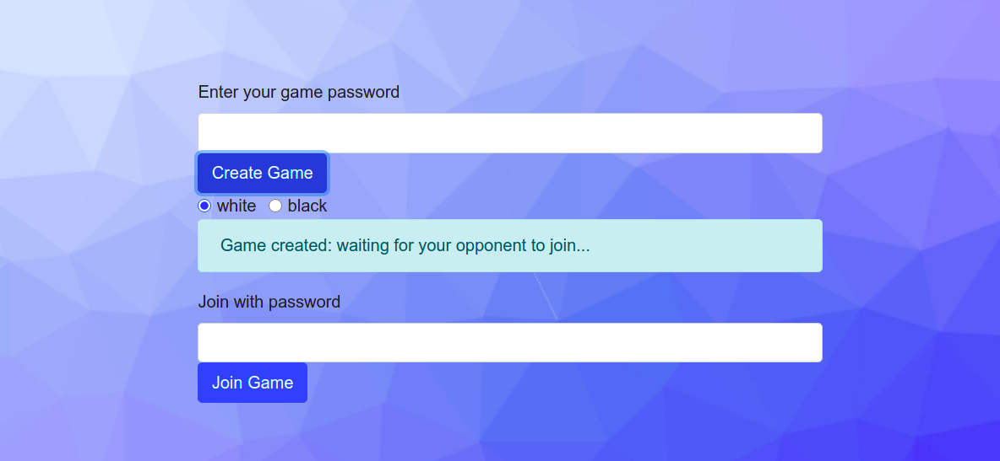
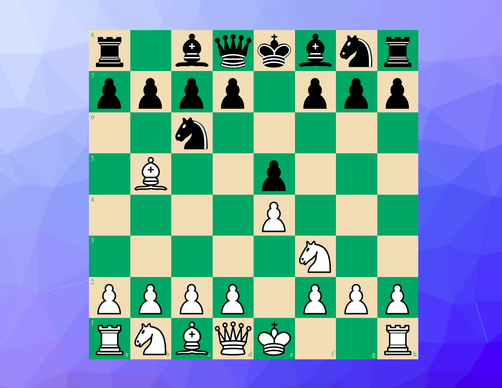

# Multiplayer Chess App

This is a multiplayer chess app created using React.js, Node.js, Express.js and Socket.io. For validating rules of chess and rendering the chessboard we use the open source react libraries chess.js and chessboard.js.

## Usage

Two players can play the game of chess over the internet in real time using this app. Player one first goes to the url of the game. There they create a new game room by creating a passcode. Then they share that passcode to their friend. The game starts whenever the player two joins the game using the passcode.

## Running the App on Your Local Device

After installing all of the dependencies of the project.

1. Run `node server.js` from the src directory.
2. Run `npm start` from the root directory. 

This will start the server as well as the react frontend environment on your local machine. Go to `localhost:3000` to see the code in action.

## Screenshots

